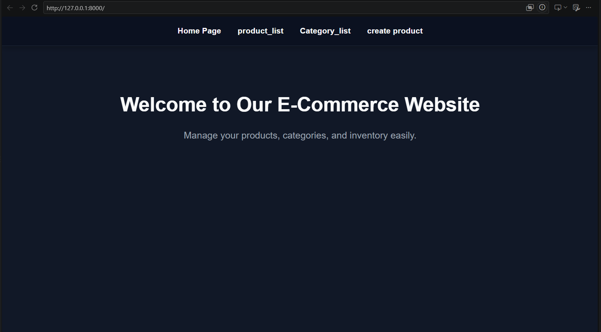
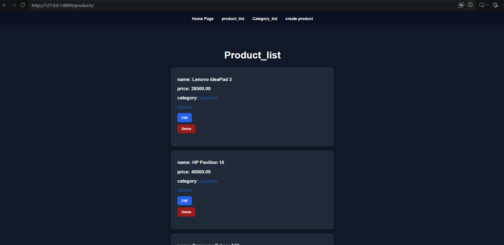
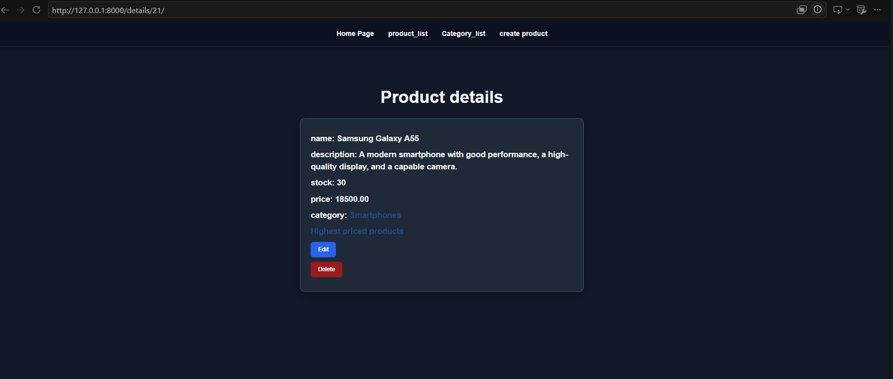
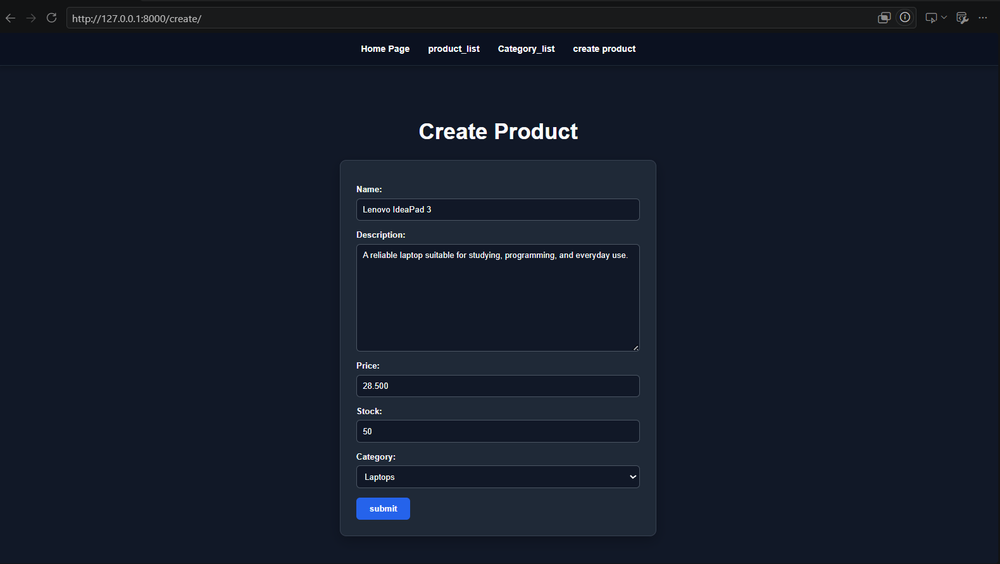
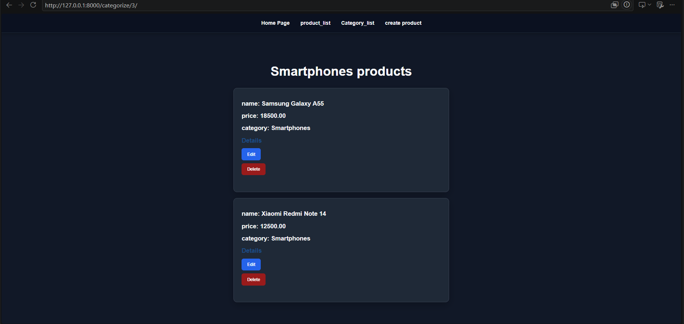
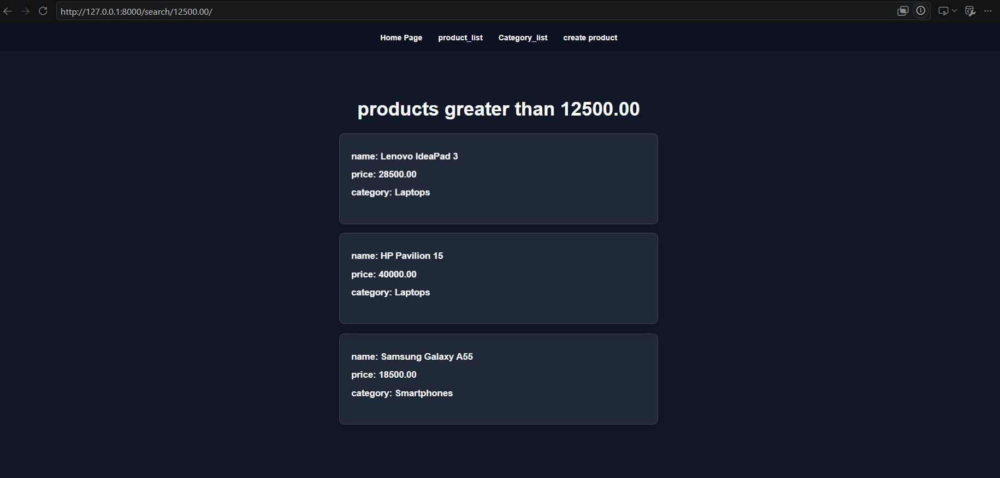
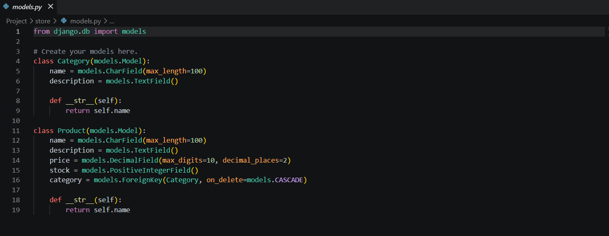

# 🛒 Django E-Commerce Store

A product management web app built with **Django**. Browse products, filter them by category or price, and create, edit, and delete products through a clean dark-themed interface.

## ✨ Features

- Browse all products and view detailed info for each one
- Filter products by **category**
- Search for products priced **above a given amount**
- Create and edit products using Django **ModelForms** (one template reused for both)
- Browse all categories and jump into their products
- Template inheritance with a shared navigation bar
- Dark-themed, responsive UI built with custom CSS
- Django Admin panel for managing data

## 🛠️ Tech Stack

- Python
- Django
- SQLite
- HTML & CSS
- [uv](https://docs.astral.sh/uv/) for dependency management

## 🗂️ Data Models

| Model    | Fields                                                       |
|----------|--------------------------------------------------------------|
| Category | `name`, `description`                                        |
| Product  | `name`, `description`, `price`, `stock`, `category` (FK)     |

Each product belongs to one category (one-to-many relationship).

## 🔗 URLs

| URL                    | Description                              |
|------------------------|------------------------------------------|
| `/`                    | Home page                                |
| `/products/`           | List all products                        |
| `/details/<id>/`       | Product details                          |
| `/categories/`         | List all categories                      |
| `/categorize/<id>/`    | Products in a specific category          |
| `/search/<price>/`     | Products priced above the given amount   |
| `/create/`             | Create a new product                     |
| `/edit/<id>/`          | Edit a product                           |
| `/delete/<id>/`        | Delete a product                         |
| `/admin/`              | Django Admin panel                       |

## 📸 Screenshots

| Home | Product List | Product Details |
|:----:|:------------:|:---------------:|
|  |  |  |

| Create Product | Category Filter | Price Search |
|:--------------:|:---------------:|:------------:|
|  |  |  |

| Models |
|:------:|
|  |

## 🚀 Getting Started

**Requirements:** Python 3.14+ (as set in `pyproject.toml`) and [uv](https://docs.astral.sh/uv/getting-started/installation/).

```bash
# 1. Clone the repository
git clone https://github.com/YOUR_USERNAME/django-ecommerce-store.git
cd django-ecommerce-store

# 2. Install dependencies
uv sync

# 3. Apply migrations
uv run python manage.py migrate

# 4. (Optional) Create an admin user
uv run python manage.py createsuperuser

# 5. Run the server
uv run python manage.py runserver
```

Then open `http://127.0.0.1:8000/` in your browser.

## 🔮 Future Improvements

- Confirmation page for deleting products, and use POST instead of GET for deletion
- User authentication and permissions
- Product images
- Shopping cart and checkout
- Pagination and text search
- Unit tests

## 👤 Author

- LinkedIn: https://www.linkedin.com/in/ahmed-ali
- GitHub: https://github.com/Ahmedali1910
